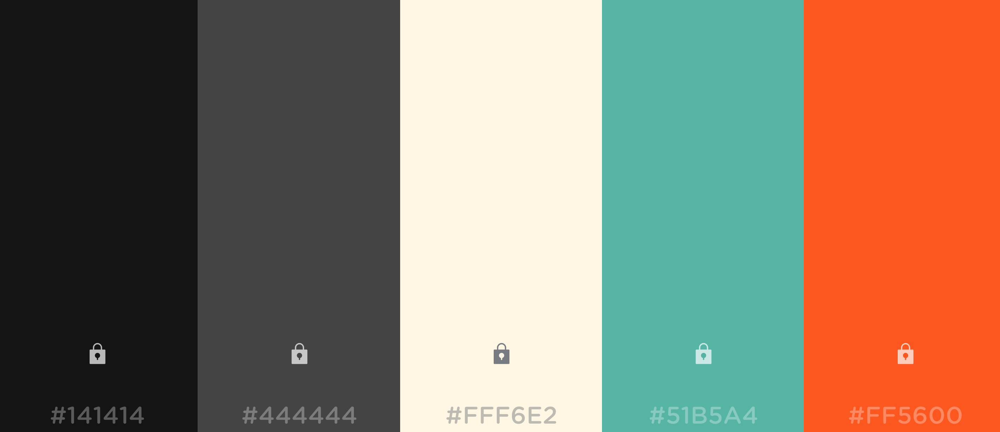

### <u>Color Scheme</u>

#### #141414 & #444444

These colors were used to create a sense of straightforwardness and non-distraction.

#### #FFF6E2 & #FF5600

This "warm" color is used to create a sense of energy, happiness, creativity and passion. Its main purpose on our site is to showcase the work that needs critique or just show off!

#### #51B5A4

The "cool" color is used to create a sense of calmness, relaxation, and professionalism. This will be primarily used for the critique.
